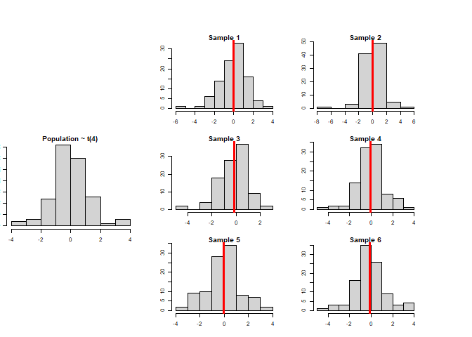
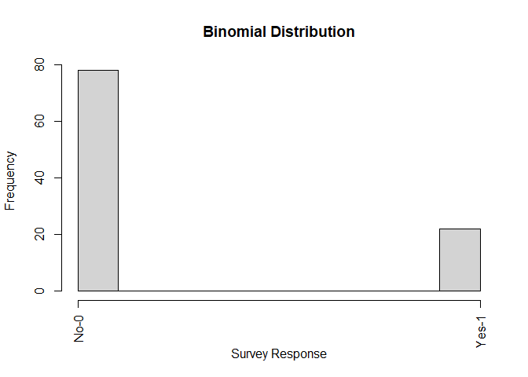
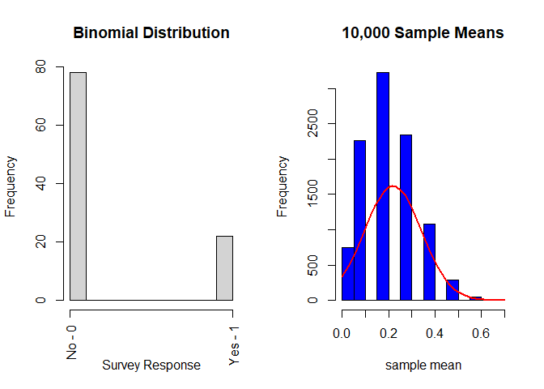
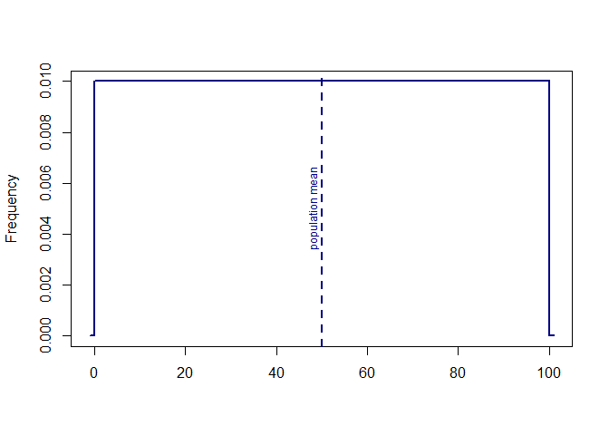
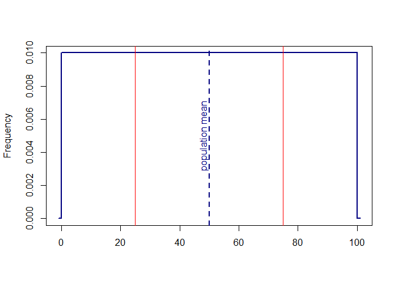
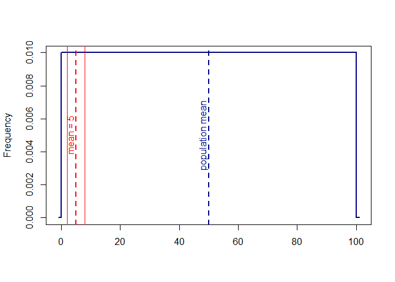
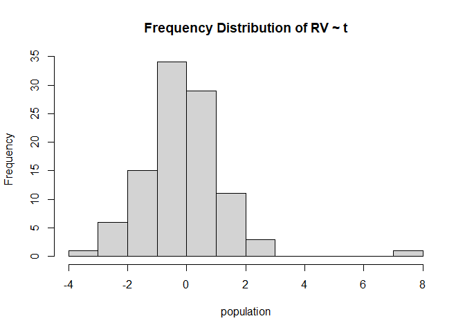
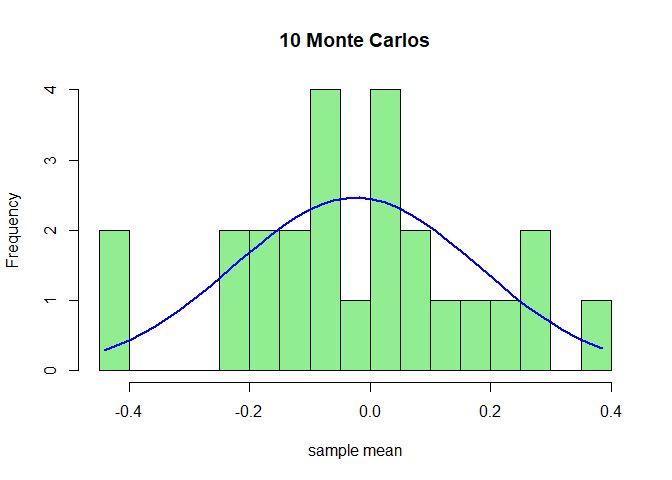
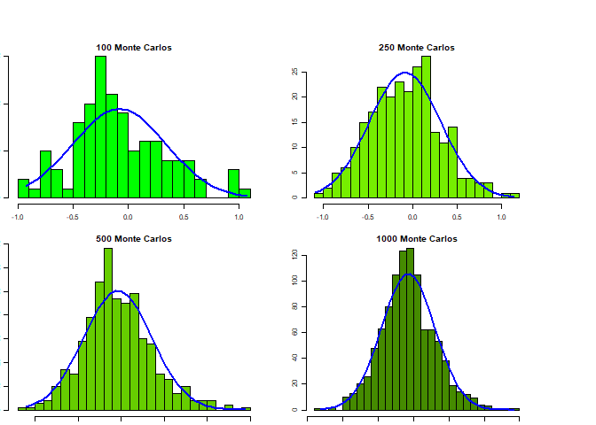
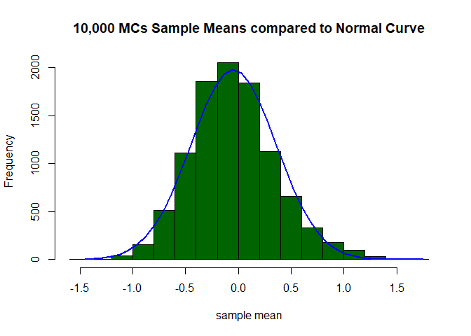

Five Minute Analytics: Central Limit Theorem
================

## The Central Limit Theorem

According to probability theory

> *The frequency distribution of samples means from a population tend
> towards a normal distribution with the same mean and standard
> deviation.*

## Why do I care?

As analysts, rarely do we have all the data about what we are trying to
model (in other words, we don’t know the true population). Instead, we
have samples from the unknown, true population.

Which individual sample mean will reflect the true population
mean?



*We don’t know.*

However, according to the Central Limit Theorem, the individual sample
means will cluster around the true population mean. Provided it is large
enough, our sample can offer an **unbiased estimate** of the true
population’s parameters.

## Nothing Normal here

A binomial random variable is certainly not
normal.



But after 5,000 samples from the
population…



*How is this possible?*

## The Intuition

Consider a true population with a uniform distribution taking discrete
values between 0 and 100 with a mean of 50:


Pick two integers between 0 and 100 with a mean of 50. I chose 75 and
25, but there are many others.


Now pick two integers between 0 and 100 with a mean of 5. There are far
fewer options


**Result:** *The mean of your sample means is more likely to reflect the
mean of the true population\!*

## Proof through Monte Carlo Simulation

Let’s consider the t-distribution.

### Theoretical Claim:

> > The frequency distribution of a random variable \(bar{X}\) from a t
> > distribution with 4 degrees of freedom and with n = 100 will follow
> > a normal distribution around a mean of 0 (for a t distribution with
> > df\>1).



#### Distribution & 25 Simulations:

The blue representing the normal curve shows our random variable is
decided not normally distributed.

``` r
# Sample and compute x_bar_i; store; repeat 24 times and check
x_bar_i <- c()
x_bar_i <- replicate(25, append(x_bar_i,mean(as.matrix(sample(population,10)))))

# Compare frequency dist of x_bar_i to normal curve after 50 samples
h<-hist(x_bar_i, breaks=20, col="light green", xlab="sample mean",
        main="10 Monte Carlos")
xfit<-seq(min(x_bar_i),max(x_bar_i),length=40)
yfit<-dnorm(xfit,mean=mean(x_bar_i),sd=sd(x_bar_i))
yfit <- yfit*diff(h$mids[1:2])*length(x_bar_i)
lines(xfit, yfit, col="blue", lwd=2)
```



#### Simulate 100-1,000 times



*Now, with 10,000 simulations, we can clearly see the frequency
distribution of our sample means following a normal
curve.*


